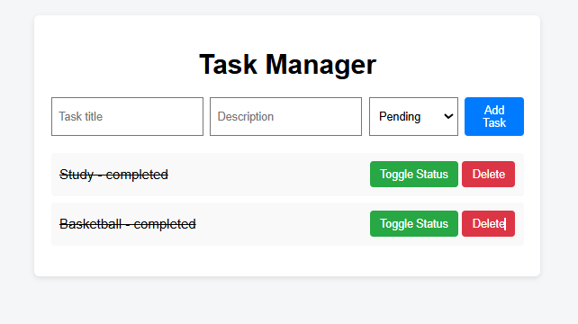

## 📋 Overview

**Task Management Web Application** is a full-stack web application developed by **Shiv Nand** for managing daily tasks efficiently. Users can create tasks, view them in an organized list, update task status, and delete tasks through a clean and responsive interface.

This project was built as part of a **Full Stack Development Internship skill assessment**.

## 📸 Screenshot



## ✨ Features

- **Task Creation**: Create tasks with title, description, and status
- **Task Listing**: View all tasks in a structured list
- **Task Status Update**: Mark tasks as pending or completed
- **Task Deletion**: Delete tasks easily
- **Persistent Storage**: Tasks stored securely using MongoDB
- **Responsive Design**: Works across different screen sizes
- **Simple UX**: Clean and intuitive user interface

## 🛠️ Tech Stack

This project is built using modern web technologies:

- **Node.js** – JavaScript runtime for backend
- **Express.js** – Web framework for building REST APIs
- **MongoDB** – NoSQL database for persistent storage
- **HTML** – Markup language for frontend structure
- **CSS** – Styling and layout
- **JavaScript** – Frontend interactivity and logic

## 🚀 Getting Started

### Prerequisites

Before you begin, ensure you have the following installed:

- **Node.js** 16.0 or higher
- **npm** package manager
- **MongoDB** installed and running locally

### Installation & Setup

1. **Clone the repository**

   ```bash
   git clone <your-repository-url>
   cd task-manager

   ```

2. **Install backend dependencies**
   ```bash
   cd backend
   npm install
   ```
3. **Configure environment variables**

   Create a `.env` file inside the `backend` directory:

   ```env
   MONGO_URI=mongodb://127.0.0.1:27017/taskmanager
   ```

4. **Run the backend server**
   ```bash
   npm start
   ```
5. **Run the frontend**

   Navigate to the frontend directory and open the application:

   ```bash
   cd ../frontend
   ```
